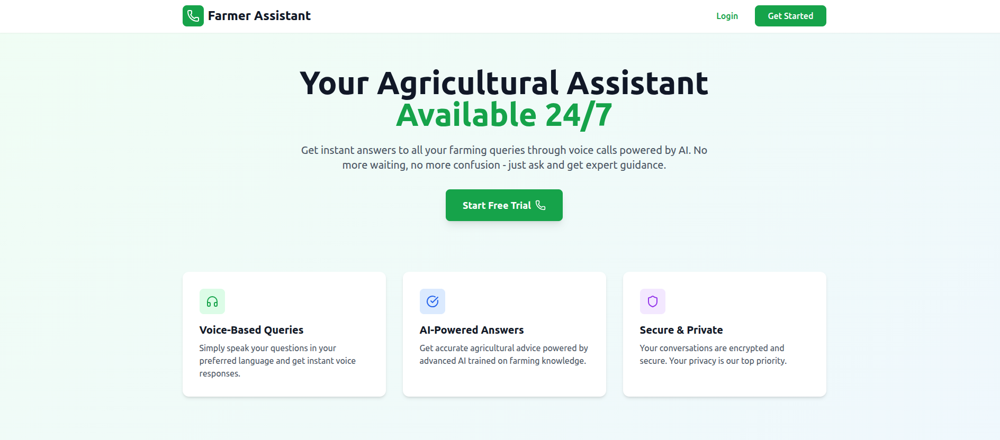

# Farmer Assistant - AI-Powered Voice Assistant for Farmers

An intelligent web application that helps farmers get instant answers to their agricultural queries through voice-based conversations powered by Google's Gemini AI.



## Features

- **Secure Authentication** - Email verification with OTP, JWT tokens
- **Voice Conversations** - Real-time speech-to-text and text-to-speech
- **AI-Powered Responses** - Gemini AI for expert agricultural guidance
- **Responsive Design** - Works seamlessly on desktop and mobile
- **Conversation History** - View and search past conversations
- **Real-time Communication** - WebSocket support via Socket.io
- **Profile Management** - Update profile and change password
- **Password Recovery** - Forgot password with email reset link

## Tech Stack

### Backend
- Node.js & Express.js
- MongoDB with Mongoose
- Socket.io for WebSockets
- Google Generative AI (Gemini)
- JWT for authentication
- Nodemailer for emails
- Bcrypt for password hashing

### Frontend
- React 18 with Vite
- Tailwind CSS
- Zustand for state management
- React Router v6
- Socket.io Client
- Web Speech API (STT/TTS)
- React Hot Toast
- Lucide React icons

## Prerequisites

Before running this project, make sure you have:

- Node.js (v16 or higher)
- MongoDB (local or Atlas)
- Gmail account (for email verification)
- Google Gemini AI API key

## Getting Started

### 1. Clone the Repository

```bash
cd Capstone
```

### 2. Backend Setup

```bash
cd backend

# Install dependencies
npm install

# Create .env file (copy from .env.example)
cp .env.example .env

# Edit .env file with your credentials
```

**Configure Backend Environment Variables (.env):**

```env
PORT=5000
NODE_ENV=development

# MongoDB
MONGODB_URI=mongodb://localhost:27017/farmer-assistant

# JWT Secrets (change these!)
JWT_SECRET=your_super_secret_jwt_key_here
JWT_REFRESH_SECRET=your_refresh_secret_key_here
JWT_EXPIRE=24h
JWT_REFRESH_EXPIRE=7d

# Email (Gmail)
EMAIL_HOST=smtp.gmail.com
EMAIL_PORT=587
EMAIL_USER=your_email@gmail.com
EMAIL_PASSWORD=your_gmail_app_password

# OTP
OTP_EXPIRE_MINUTES=10

# Frontend URL
FRONTEND_URL=http://localhost:5173

# Gemini AI
GEMINI_API_KEY=your_gemini_api_key_here
```

**Gmail App Password Setup:**
1. Go to Google Account settings
2. Enable 2-Factor Authentication
3. Generate App Password for "Mail"
4. Use that password in EMAIL_PASSWORD

**Gemini API Key Setup:**
1. Go to [Google AI Studio](https://makersuite.google.com/app/apikey)
2. Create a new API key
3. Copy and paste it in GEMINI_API_KEY

### 3. Frontend Setup

```bash
cd ../frontend

# Install dependencies
npm install

# Create .env file
cp .env.example .env
```

**Configure Frontend Environment Variables (.env):**

```env
VITE_API_URL=http://localhost:5000/api
VITE_SOCKET_URL=http://localhost:5000
```

### 4. Start MongoDB

Make sure MongoDB is running:

```bash
# If using local MongoDB
mongod

# Or use MongoDB Atlas (cloud) - update MONGODB_URI in backend .env
```

### 5. Run the Application

**Terminal 1 - Backend:**
```bash
cd backend
npm run dev
```

**Terminal 2 - Frontend:**
```bash
cd frontend
npm run dev
```

The application will be available at:
- Frontend: http://localhost:5173
- Backend API: http://localhost:5000

## Project Structure

```
Capstone/
├── backend/
│   ├── config/
│   │   └── database.js          # MongoDB connection
│   ├── controllers/
│   │   ├── auth.controller.js   # Auth logic
│   │   └── conversation.controller.js  # Conversation logic
│   ├── middleware/
│   │   └── auth.middleware.js   # JWT verification
│   ├── models/
│   │   ├── User.model.js        # User schema
│   │   └── Conversation.model.js # Conversation schema
│   ├── routes/
│   │   ├── auth.routes.js       # Auth endpoints
│   │   └── conversation.routes.js # Conversation endpoints
│   ├── services/
│   │   └── gemini.service.js    # Gemini AI integration
│   ├── socket/
│   │   └── socketHandler.js     # WebSocket events
│   ├── utils/
│   │   ├── email.js             # Email templates
│   │   └── jwt.js               # Token utilities
│   ├── .env
│   ├── package.json
│   └── server.js
│
└── frontend/
    ├── public/
    ├── src/
    │   ├── components/
    │   │   └── ProtectedRoute.jsx
    │   ├── pages/
    │   │   ├── Landing.jsx      # Home page
    │   │   ├── Login.jsx        # Login page
    │   │   ├── Register.jsx     # Registration page
    │   │   ├── VerifyOTP.jsx    # OTP verification
    │   │   ├── Dashboard.jsx    # Main dashboard
    │   │   ├── VoiceCall.jsx    # Voice call interface
    │   │   ├── Profile.jsx      # User profile
    │   │   ├── History.jsx      # Conversation history
    │   │   ├── ForgotPassword.jsx  # Password recovery
    │   │   └── ResetPassword.jsx   # Password reset
    │   ├── services/
    │   │   ├── api.js           # Axios instance
    │   │   ├── auth.service.js  # Auth API calls
    │   │   ├── conversation.service.js # Conversation API
    │   │   └── socket.service.js # Socket.io client
    │   ├── store/
    │   │   ├── authStore.js     # Auth state
    │   │   └── conversationStore.js # Conversation state
    │   ├── App.jsx
    │   ├── main.jsx
    │   └── index.css
    ├── .env
    ├── package.json
    └── vite.config.js
```

## API Endpoints

### Authentication
| Method | Endpoint | Description | Auth |
|--------|----------|-------------|------|
| POST | `/api/auth/register` | Register new user | No |
| POST | `/api/auth/verify-otp` | Verify email OTP | No |
| POST | `/api/auth/resend-otp` | Resend OTP | No |
| POST | `/api/auth/login` | Login user | No |
| POST | `/api/auth/refresh-token` | Refresh access token | No |
| POST | `/api/auth/forgot-password` | Request password reset | No |
| POST | `/api/auth/reset-password` | Reset password | No |
| GET | `/api/auth/me` | Get current user | Yes |
| PUT | `/api/auth/profile` | Update profile | Yes |
| PUT | `/api/auth/change-password` | Change password | Yes |

### Conversations
| Method | Endpoint | Description | Auth |
|--------|----------|-------------|------|
| GET | `/api/conversations` | Get all conversations | Yes |
| GET | `/api/conversations/:id` | Get conversation by ID | Yes |
| DELETE | `/api/conversations/:id` | Delete conversation | Yes |

### WebSocket Events
| Event | Direction | Description |
|-------|-----------|-------------|
| `conversation:start` | Client → Server | Start new conversation |
| `conversation:join` | Client → Server | Join existing conversation |
| `message:send` | Client → Server | Send message to AI |
| `message:received` | Server → Client | AI response received |
| `conversation:end` | Client → Server | End conversation |

## Project Status

### Completed Features
- User authentication (Register, Login, Logout)
- Email verification with OTP
- JWT token authentication with refresh
- Password recovery (Forgot/Reset password)
- User profile management
- Password change functionality
- WebSocket integration (Socket.io)
- Gemini AI integration for agricultural queries
- Voice call interface
- Speech-to-Text (Web Speech API)
- Text-to-Speech (Web Speech API)
- Conversation history storage
- View past conversations
- Delete conversations
- Rate limiting on auth endpoints
- Responsive UI design
- Protected routes

### Known Limitations
- Gemini AI free tier has quota limits
- Web Speech API requires Chrome/Edge for best support
- Speech recognition requires microphone permission

## Testing the Application

1. **Register a New Account:**
   - Go to http://localhost:5173
   - Click "Get Started" or "Register"
   - Fill in your details (name, email, phone, password)
   - Check your email for OTP

2. **Verify Email:**
   - Enter the 6-digit OTP from your email
   - You'll be logged in and redirected to dashboard

3. **Start a Voice Call:**
   - Click "Start Call" on the dashboard
   - Allow microphone access when prompted
   - Speak your farming questions
   - Listen to AI responses

4. **View History:**
   - Click "History" to see past conversations
   - Search and filter conversations
   - View full conversation details

5. **Manage Profile:**
   - Click "Profile" to view/edit your details
   - Update name and phone number
   - Change password securely

## Security Features

- Password hashing with bcrypt (10 rounds)
- JWT access tokens (24h expiry)
- JWT refresh tokens (7d expiry)
- Rate limiting on auth endpoints
- Helmet for security headers
- CORS configuration
- OTP expiry (10 minutes)
- OTP attempt limits
- Password reset token expiry (1 hour)

## Troubleshooting

### MongoDB Connection Error
- Make sure MongoDB is running
- Check MONGODB_URI in .env file
- For Atlas, ensure IP whitelist includes your IP

### Email Not Sending
- Verify Gmail credentials
- Use App Password (not regular password)
- Check EMAIL_USER and EMAIL_PASSWORD in .env

### Gemini AI Not Responding
- Verify GEMINI_API_KEY is correct
- Check API quota limits
- Ensure internet connectivity

### Speech Recognition Not Working
- Use Chrome or Edge browser
- Allow microphone permissions
- Check if microphone is working
- Speak clearly and wait for processing

### Port Already in Use
- Change PORT in backend .env
- Update VITE_API_URL and VITE_SOCKET_URL in frontend .env

## Future Enhancements

- Multi-language support (Hindi, regional languages)
- Offline mode with cached responses
- Image-based crop disease detection
- Weather integration
- Market price information
- Push notifications
- Mobile app (React Native)
- Admin dashboard

## License

This project is for educational purposes (Capstone Project).

## Contributers


* **[Abhijeet Singh](https://github.com/Abhijeet14d)**
* **[Adarsh Gupta](https://github.com/Adarsh097)**


---

**Helping farmers grow better, one conversation at a time!**
